# Kapitel 1: Einführung

## Übersicht über die Applikation
Das Projekt "foodtracker" ist eine Fitness-Tracking-Anwendung, die Benutzern hilft, ihre Fitnessziele zu verfolgen und zu erreichen. Die Anwendung bietet verschiedene Funktionen, darunter die Verwaltung von Benutzern, das Erstellen und Verfolgen von Gym-Plänen, das Protokollieren von Mahlzeiten und das Verfolgen von Gewichtsveränderungen.

Funktionsweise der Anwendung:
1.	Benutzerverwaltung: Benutzer können sich registrieren, einloggen und ausloggen. Benutzerinformationen werden in einem Repository gespeichert und verwaltet.
2.	Gym-Pläne: Benutzer können Gym-Pläne basierend auf ihren Fitnesszielen erstellen. Gym-Pläne werden in einem Repository gespeichert und können geladen und angezeigt werden.
3.	Nährstoff Tracking: Benutzer können ihre täglichen Mahlzeiten protokollieren. Mahlzeiteninformationen werden in einem Repository gespeichert und können geladen und angezeigt werden.
4.	Gewichts Tracking: Benutzer können ihr Gewicht protokollieren und Veränderungen verfolgen. Gewichtsinformationen werden in einem Repository gespeichert und können geladen und angezeigt werden. Die "foodtracker" App löst das Problem der unorganisierten und ineffizienten Verfolgung von Fitness- und Ernährungszielen. Sie bietet eine zentrale Plattform, auf der Benutzer ihre Gym-Pläne, Mahlzeiten und Gewichtsveränderungen einfach und systematisch protokollieren und verfolgen können. Der Zweck der App ist es, Benutzern zu helfen, ihre Fitnessziele zu erreichen, indem sie ihnen Werkzeuge zur Verfügung stellt, um ihre Fortschritte zu überwachen und ihre Aktivitäten zu planen.

## Wie startet man die Applikation?
Voraussetzungen:
-	lokale Kopie des Repositories
-	lokale Maven Installation

Anleitung:
1.	Navigiere in das root Directory des Projekts
2.	Installation von Abhängigkeiten:
```shell
mvn clean install
```
3.	Navigation in das Main Projekt:
```shell
cd 0-foodtracker-plugin-main
```
4.	Ausführen der App:
```shell
mvn exec:java -Dexec.mainClass="de.jmf.Main"
```

## Wie testet man die Applikation?
Voraussetzungen:
-	lokale Kopie des Repositories
-	lokale Maven Installation

Anleitung:
1.	Navigiere in das root Verzeichnis des Projekts
2.	Installation von Abhängigkeiten:
```shell 
mvn clean install
```
3.	Ausführen der Tests:
```shell
mvn test
```

# Kapitel 2: Clean Architecture

## Was ist Clean Architecture?
Clean Architecture ist ein Architekturstil, der darauf abzielt, die Abhängigkeiten innerhalb einer Softwareanwendung zu minimieren und die Wartbarkeit und Testbarkeit zu maximieren. 
Die Hauptidee besteht darin, die Geschäftslogik von den Details der Implementierung zu trennen. 
Dies wird durch die Trennung der Anwendung in verschiedene Schichten erreicht, wobei jede Schicht eine spezifische Rolle spielt und nur auf die unmittelbar darunter liegende Schicht zugreift. 

## Analyse der Dependency Rule
Alle Schichten des Projekts sind in eigene Projekte aufgeteilt, innere Schichten wurden als Dependency an die Äußeren übergeben. Dies unterstützt die Dependency Rule.

```
├── 0-foodtracker-plugin-main
├── 1-foodtracker-adapters
├── 2-foodtracker-application
└── 3-foodtracker-domain
```


### Positiv-Beispiel: ProgressRepository
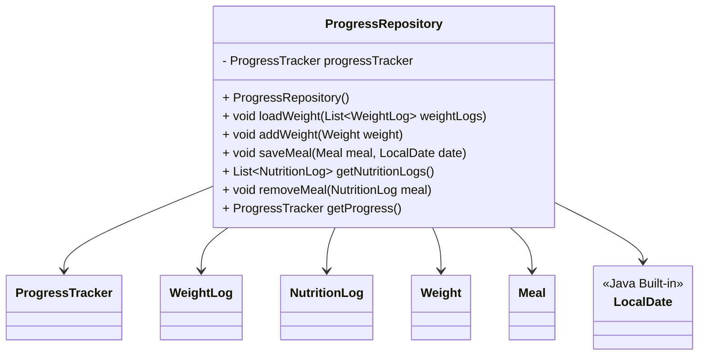

Analyse:
- Die Klasse 'ProgressRepository' hat ProgressTracker, WeightLog, NutritionLog, Weight, Meal und LocalDate als Abhängigkeiten aus dem Domain Layer.
- Die Klasse hält sich an die Dependency Rule, da die Abhängigkeiten aus dem Domain Layer stammen und die Klasse selbst im Application Layer liegt.

#### Analyse

### Negativ-Beispiel: CreateUser
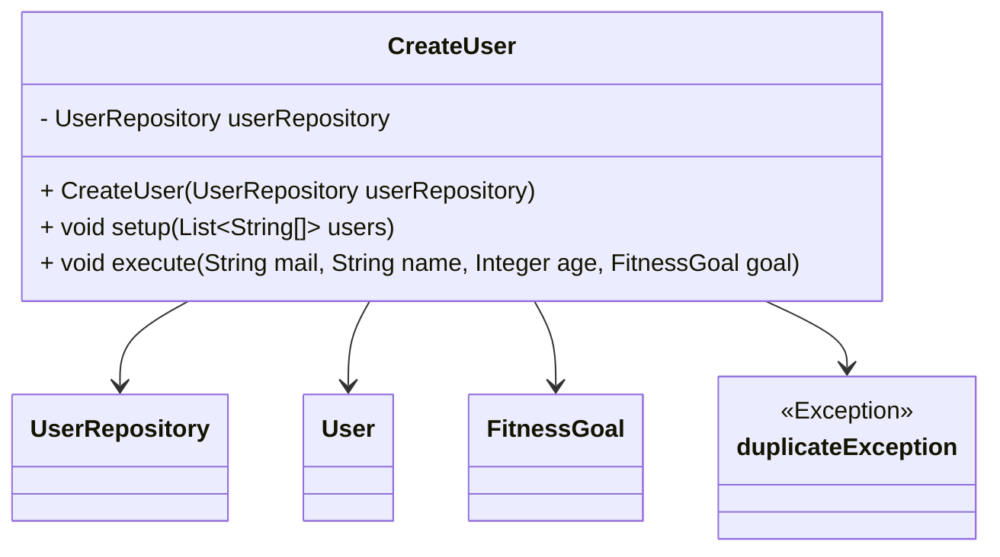

Analyse:
- Die Klasse 'CreateUser' hat User und FitnessGoal als Abhängigkeiten aus dem Domain Layer und UserRepository und duplicateException aus dem Application Layer.
- Die Klasse verletzt die Dependency Rule, da sie Abhängigkeiten aus dem Domain Layer und aus dem eigenen Layer (Application Layer) hat.

## Analyse der Schichten

### Schicht: Application Layer
Klasse: GetTodaysMeals

Die Klasse GetTodaysMeals ist verantwortlich für das Abrufen der Mahlzeiten des aktuellen Tages. Sie gehört zum Application Layer und greift auf das ProgressRepository zu, um die Mahlzeiten zu laden und zurückzugeben.

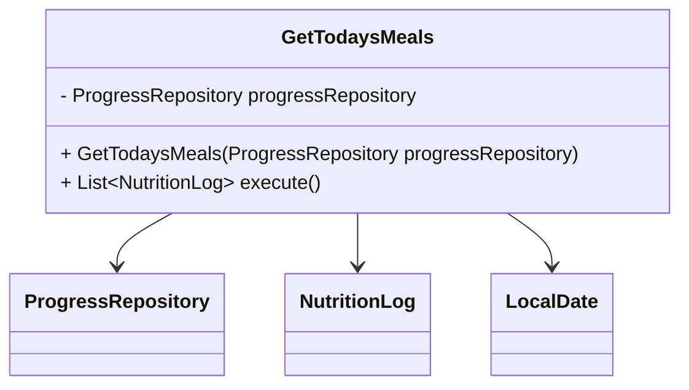

Erklärung:

- Verantwortung: Die Klasse ist darauf spezialisiert, die Mahlzeiten des aktuellen Tages zu filtern und zurückzugeben.
- Abhängigkeiten:
  - ProgressRepository: Wird verwendet, um alle gespeicherten Mahlzeiten zu laden.
  - NutritionLog: Repräsentiert die einzelnen Mahlzeiten.
  - LocalDate: Dient zur Bestimmung des aktuellen Datums.
- Schichtzuordnung: Die Klasse gehört zum Application Layer, da sie die Geschäftslogik für die Verarbeitung von Mahlzeiten implementiert, ohne sich um die Details der Datenquelle zu kümmern.


### Schicht: Domain Layer
Klasse: ProgressTracker

Die Klasse ProgressTracker ist verantwortlich für das Tracking von Gewicht und Ernährung. Sie gehört zum Domain Layer, da sie die Geschäftslogik für das Verwalten von WeightLogs und NutritionLogs enthält.

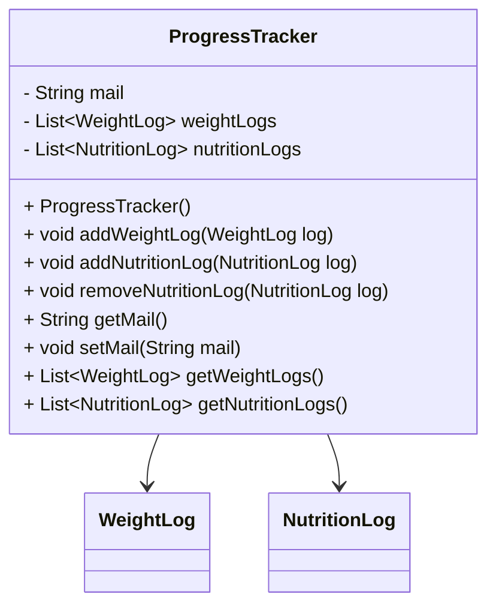

Erklärung:

- Verantwortung: Die Klasse ProgressTracker dient als zentrale Komponente für das Verwalten von WeightLogs und NutritionLogs. Sie ermöglicht das Hinzufügen, Entfernen und Abrufen dieser Daten.
- Abhängigkeiten:
  - WeightLog: Repräsentiert einzelne Gewichtseinträge.
  - NutritionLog: Repräsentiert einzelne Ernährungsprotokolle.
- Schichtzuordnung: Die Klasse gehört zum Domain Layer, da sie die Kernlogik für das Tracking von Gewicht und Ernährung implementiert und keine Abhängigkeiten zu äußeren Schichten hat.

# Kapitel 3: SOLID
## Analyse Single-Responsibility-Principle (SRP)
### Positiv-Beispiel
UML:
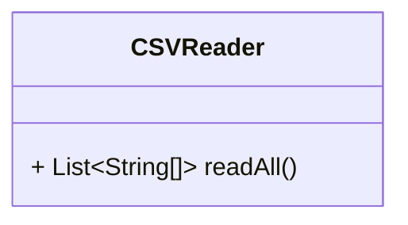

Begründung:<br>
Unsere Klasse 'CSVReader' hat eine einzige Verantwortlichkeit. Und zwar das Lesen von CSV-Dateien. Sie kümmert sich nur um das Einlesen der Daten und gibt diese dann in geeigneter Form wieder zurück.

### Negativ-Beispiel
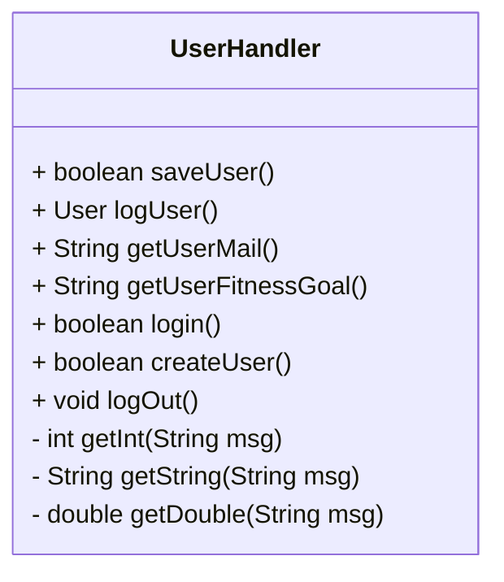
Begründung:<br>
Der 'UserHandler' hingegen hat mehrere Verantwortlichkeiten. Auch wenn der 'Handler' zunächst als Klasse gesehen werden kann, die ja nur für das Handling von Benutzeraktionen dient, verstößt sie dennoch gegen das SRP. Diese Klasse kümmert sich hier nämlich um Benutzereingaben, um die Geschäftslogik und um das Persistieren von Nutzerdaten. 

*Lösungsweg*:<br>
Man sollte einen dedizierten InputHandler für die Benutzereingaben einbauen.

#### Commit zur Behebung
https://github.com/ASE-Foodtracker/x-foodtracker/commit/fa13e490e1872d75a89f34bbe5ec0ac47706e0e6#diff-2a5fb3c4109d43aef6bc73287d8628a4d57c40cd1120466b5ed032e34d0beb8e

## Analyse Open-Closed-Principle (OCP)
### Positiv-Beispiel
UML:

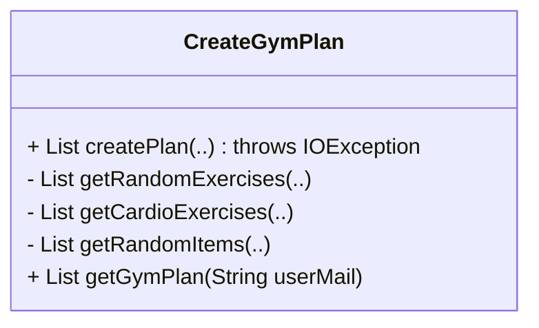
Begründung:<br>
Unsere 'CreateGymPlan' Klasse ist offen für Erweiterungen und zeitgleich geschlossen für Veränderungen. Das heißt, dass wir neue Fitnessziele durch neue Methoden oder Vererbung hinzufügen können, ohne dabei die bestehende Klasse zu verändern.

### Negativ-Beispiel
UML:

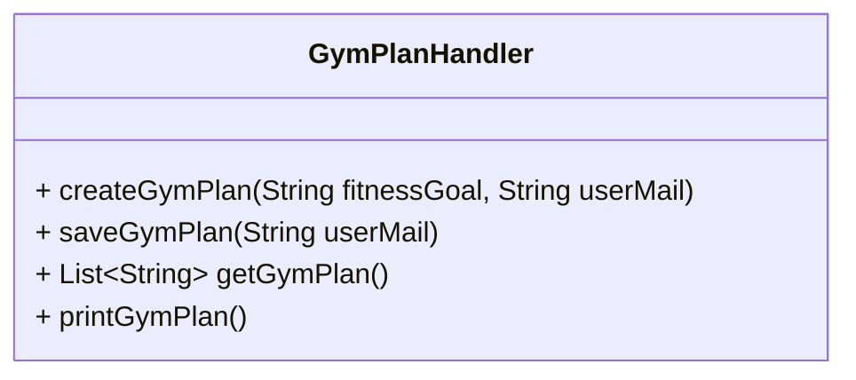
Begründung:<br>
Der 'GymPlanHandler' wiederum ist nicht offen für Erweiterungen, da Änderungen an der Art und Weise wie Gym-Pläne erstellt oder gespeichert werden, eine Änderung an der Klasse selbst erfordern.

*Lösungsweg*: <br>
So abändern, dass neue Funktionalitäten durch bspw. Vererbungen hinzugefügt werden können.

## Analyse Liskov-Substitution-Principle (LSP)
Sei S ein von T abgeleiteter Typ, dann können Objekte des Typs T durch Objekte des Typs S ersetzt werden, ohne das Programm zu beschädigen.
[Barbara Liskov](https://www.assets.dpunkt.de/leseproben/12309/4_Das%20Liskovsche%20Substitutionsprinzip.pdf)
### Positiv-Beispiel
UML:

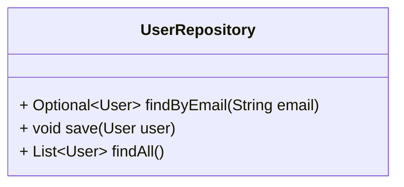

Begründung:<br>
Die Klasse 'UserRepository' kann durch jede andere Implementierung eines Benutzer-Repositories ersetzt werden, ohne dass das Verhalten des Programms verändert wird.

### Negativ-Beispiel
UML:
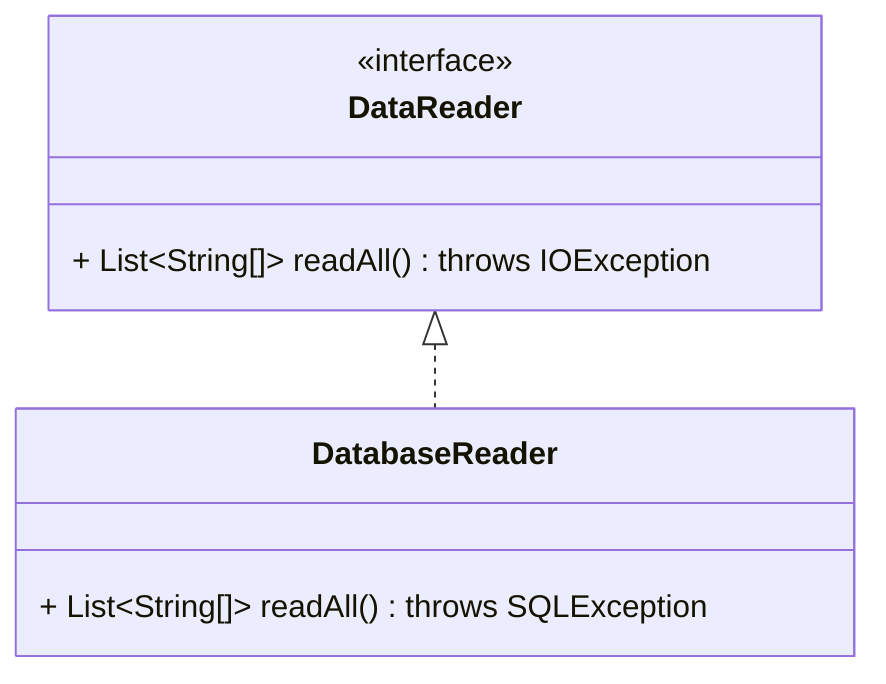
Begründung:<br>
Das Interface DataReader erlaubt beim Lesen nur eine IOException. Eine Klasse DatabaseReader kann dagegen eine SQLException werfen, die nicht von IOException erbt. Jeder Client, der nur mit DataReader arbeitet, rechnet nicht mit SQLException und fängt sie nicht ab. Kommt eine SQLException, bricht die Anwendung an dieser Stelle unerwartet ab. Damit lässt sich DatabaseReader nicht ohne Risiko anstelle eines beliebigen DataReader verwenden.

*Lösungsweg:*<br>
1.  **Gemeinsame Super-Exception einführen:** 
    - Neue Basis-Exception RepositoryException im Interface deklarieren.
    - Sowohl IOException als auch SQLException (bzw. eigene Unterklassen wie DatabaseReadException) erben von dieser.
    - Clients fangen dann nur noch RepositoryException.
2.  **SQLException in IOException umwandeln:**
    ```Java
        @Override
        public List<String[]> readAll() throws IOException {
            try {
                // Datenbankzugriff…
            } catch (SQLException e) {
                throw new IOException("Datenbank-Lese-Fehler", e);
            }
        }
    ```
    So bleibt die Signatur gleich und Clients müssen nur IOException behandeln.
3.  **Ergebnisobjekt statt Exception:** 
    - Rückgabetyp etwa Result<List<String[]>, Error> oder Optional<List<String[]>>.
    - Im Fehlerfall liefert das Objekt eine Fehlermeldung statt eine Exception.
    - Checked Exceptions entfallen, der Aufrufer prüft das Ergebnis direkt.

# Kapitel 4: Weitere Prinzipien
## Analyse GRASP: Geringe Kopplung

### Positiv-Beispiel
UML:
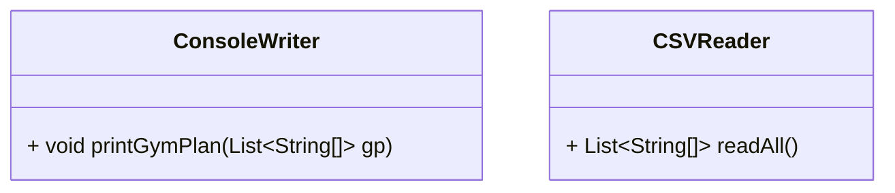
Begründung: <br>
Die Klassen ConsoleWriter und CSVReader sind perfekte Beispiele für die geringe Kupplung. Sie sind unabhänging voneinander aber haben ihre klar definierten Verantwortlichkeiten. ConsoleWriter beschäftigt sich nur um die Ausgabe des GymPlans und CSVReader nur um die Einlesung.
### Negativ-Beispiel
UML:
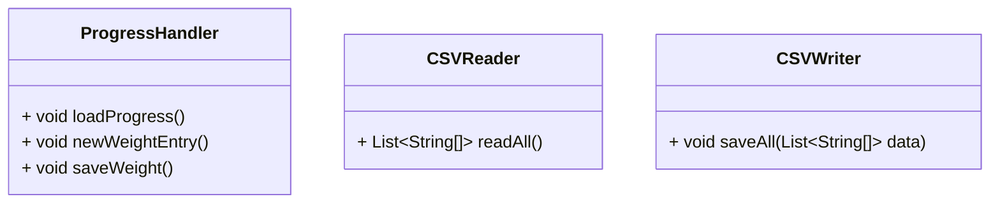
Begründung:<br>
Die Klasse 'ProgressHandler' hat eine starke Kopplung zu den Klassen CSVReader und CSVWriter. Jede Änderung in den Methoden readAll oder saveAll können zu Fehlern in der ProgressHandler-Klasse führen.

*Lösung:*<br>
Um die Kopplung zu lösen, sollte der ProgressHanlder von DataReader und DataWriter erben.

## Analyse GRASP: Hohe Kohäsion
UML:

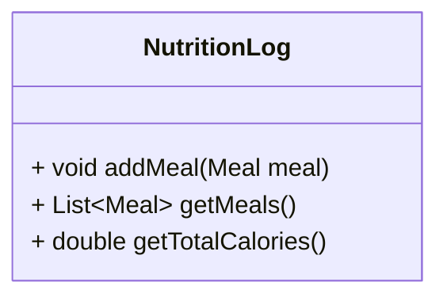

Die Klasse NutritionLog hat eine hohe Kohäsion, da alle ihre Methoden eng miteinander verbunden sind und sich auf die Verwaltung von Mahlzeiten und Nährwerten konzentrieren. Jede Methode trägt zur Hauptverantwortung der Klasse bei, was die Kohäsion erhöht und die Klasse leichter verständlich und wartbar macht.

## Don’t Repeat Yourself (DRY)

Wir haben darauf geachtet, Duplizierungen zu vermeiden.<br>
Beispielsweise durch den CSVWriter. Dank ihm haben wir diese Logik ausgelagert und können diese immerwieder von egal wo aufrufen, da wir jeweils einen eigenen Path für den Writer definieren. Er kann also alle Daten einer String List[] in ein beliebiges Verzeichnis laden.

# Kapitel 5: Unit Tests
## 10 Unit Tests
### Application Layer
1. GymPlanTest
    - testCreateGymPlanForGainWeight<br>
        **Beschreibung**: Dieser Test überprüft, ob für das Fitnessziel "Muskelaufbau" (gain) ein Fitnessplan für Montag, Mittwoch und Freitag mit insgesamt 9 Übungen bereitstellt.
    - testCreateGymPlanForLooseWeight<br>
        **Beschreibung:** Dieser Test überprüft, ob für das Fitnessziel "Abnehmen" (loose) ein Fitnessplan für jeden Tag mit einer Cardioübung zur Verfügung stellt.
    - testGetGymPlan<br>
        **Beschreibung:** Dieser Test überprüft, ob der zurückgegebene GymPlan die richtige Gesamtlenge entspricht.
    - testSetGymPlan<br>
        **Beschreibung:** Dieser Test überprüft, ob der zurückgegebene Gymplan dem gesetzten Gymplan entspricht.
2. MealsTest
    - testSaveMeal<br>
        **Beschreibung:** Dieser Test überprüft, ob das Gericht, welches gespeichert wird, auch wieder zurückgerufen werden kann.
    - testGetTodaysMeals<br>
        **Beschreibung:** Dieser Test überprüft, ob heute gespeicherte Gerichte zurückgegeben werden können.
    - testRemoveMeal<br>
        **Beschreibung:** Dieser Test überprüft, ob das gespeicherte Essen wieder entfernt werden kann.
    - testGetAllMeals<br>
        **Beschreibung:** Dieser Test überprüft, ob alle gespeicherten Gerichte ausgegeben werden können.
3. UserTest
    - testCreateUser<br>
        **Beschreibung:** Dieser Test überprüft, ob ein Benutzer erstellt werden kann.
    - testLoginUser<br>
        **Beschreibung:** Dieser Test überprüft, ob ein angemeldeter Nutzer auch als aktiver Nutzer gilt.
    - testLogOutUser<br>
        **Beschreibung:** Dieser Test überprüft, ob nach dem ausloggen der aktive Nutzer auf Null gesetzt wird.
    - testSaveUser<br>
        **Beschreibung:** Dieser Test überprüft, ob der Nutzer richtig abgespeichert wird.
4. Weight Test
    - …
### Domain Layer
1. …	
   
## ATRIP: Automatic
Die Tests werden automatisch mit Maven ausgeführt, indem der Befehl mvn test verwendet wird. Dies stellt sicher, dass die Tests bei jeder Änderung des Codes ausgeführt werden und dass keine manuellen Schritte erforderlich sind.

### ATRIP: Thorough
**Positives Beispiel:**

    @Test
    public void testSaveUser() {
        FitnessGoal goal = new FitnessGoal("gain", new Weight(70));
        createUser.execute("john.doe@example.com", "John Doe", 25, goal);

        List<String[]> users = saveUser.execute();
        assertNotNull(users);
        assertEquals(1, users.size());
        assertEquals("John Doe", users.get(0)[0]);
        assertEquals("25", users.get(0)[1]);
        assertEquals("john.doe@example.com", users.get(0)[2]);
        assertEquals("gain", users.get(0)[3]);
        assertEquals("70.0", users.get(0)[4]);
    }
**Begründung:**<br>Dieser Test aus der Klasse ```2-foodtracker-application/src/test/java/de/jmf/UserTest.java``` überprüft gründlich, ob die Methode korrekt funktioniert, indem sichergestellt wird, dass die Benutzerdaten korrekt gespeichert werden und die erwarteten Werte wieder ausgegeben werden.

**Negatives Beispiel:**

    @Test
    public void testSaveUser() {
        userHandler.saveUser();
    }
**Begründung:**<br> Hier fehlt bspw. die Verifikation des Verhaltens.

### ATRIP: Professional
**Positives Beispiel:**

    @Test
    public void testCreateUser() {
        doNothing().when(createUser).execute(anyString(), anyString(), anyInt(), any(FitnessGoal.class));

        boolean result = userHandler.createUser();

        assertFalse(result);
        verify(createUser, times(1)).execute(anyString(), anyString(), anyInt(), any(FitnessGoal.class));
    }
**Begründung:**<br> Dieser Test wäre professionell, da er auch sicherstellt, dass die execute Methode nur ein einziges Mal aufgerufen wird.

**Negatives Beispiel:**

    @Test
    public void testCreateUser() {
        userHandler.createUser();
    }
**Begründung:**<br> Dieser Test ist nicht professionell, da weder überprüft ob die Methode aufgerufen wurde, noch die Verifikation des Verhaltens überprüft.
## Code Coverage
Die Code Coverage in diesem Projekt wird mit dem Tool JaCoCo gemessen. Eine hohe Code Coverage zeigt, dass ein signifikanter Teil des Codes durch automatisierte Tests abgedeckt ist, was potenziell die Fehlerwahrscheinlichkeit reduziert. Dennoch ist eine hohe Testabdeckung allein keine Garantie für fehlerfreien Code. Fehlerhaft formulierte Assertions können dazu führen, dass bestehende Fehler unentdeckt bleiben. Um die Qualität des Codes sicherzustellen, ist es entscheidend, sowohl positive Tests (zur Verifizierung des erwarteten Verhaltens) als auch negative Tests (zur Prüfung der Fehlerbehandlung) zu implementieren.

**Analyse und Begründung**: Der Fokus der Testaktivitäten lag auf der Applikations-Schicht, da diese die zentrale Geschäftslogik des Systems enthält. Die Testsuite umfasst sowohl Unit-Tests als auch Integrationstests. In der Domain-Schicht wurden hauptsächlich die Value Objects getestet, da die übrigen Klassen dieser Schicht überwiegend aus Entitäten mit einfachen Getter- und Setter-Methoden bestehen, die kein zusätzliches Testen erfordern. 

**Report**
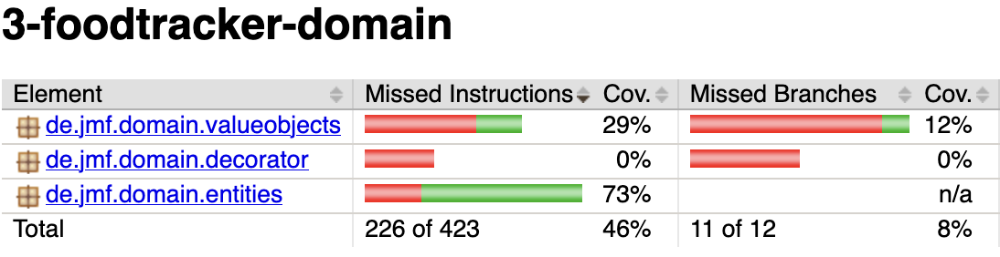

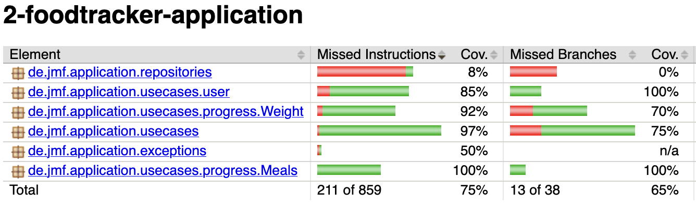

## Fakes und Mocks
Wir haben nur einen Mock erstellt.<br>
**UML:**

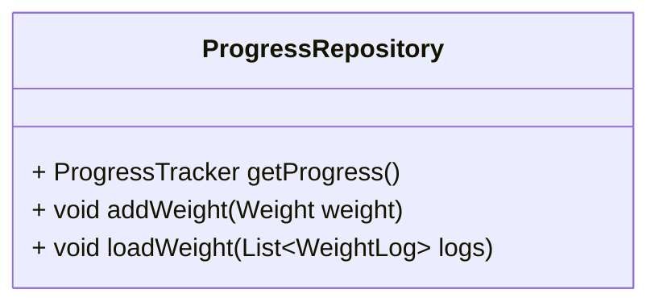

**Begründung:**<br> Der Mock für die Klasse 'ProgressRepository' wird verwendet, um die Methoden *getProgress*, *addWeight* und *loadWeight* zu simulieren. Dadurch wird sichergestellt, dass diese korrekt aufgerufen werden, ohne dabei die tatsächliche Implementierung auszuführen.


# Kapitel 6: Domain Driven Design
## Ubiquitous Language
### Bezeichnung: Benutzer
**Bedeutung:** Eine Person, die die Anwendung nutzt, um ihre Fitnessziele zu verfolgen.<br>
**Begründung:** Der Begriff "Benutzer" ist zentral für die Anwendung und wird in der gesamten Domäne verwendet, um die Hauptakteure zu beschreiben.

### Bezeichnung: GymPlan
**Bedeutung:** Ein Trainingsplan, der Übungen und deren Häufigkeit für einen bestimmten Zeitraum enthält.<br>
**Begründung:** Der Begriff "GymPlan" ist wichtig, um die Struktur und den Inhalt der Trainingspläne zu definieren, die Benutzer erstellen und verfolgen können.

### Bezeichnung: Mahlzeit
**Bedeutung:** Eine Nahrungsaufnahme, die von einem Benutzer protokolliert wird.<br>
**Begründung:** Der Begriff "Mahlzeit" ist entscheidend für das Nährstoff-Tracking und wird verwendet, um die einzelnen Einträge im Ernährungstagebuch zu beschreiben.

### Bezeichnung: Gewicht
**Bedeutung:** Das Körpergewicht eines Benutzers, das regelmäßig protokolliert wird.<br>
**Begründung:** Der Begriff "Gewicht" ist zentral für das Gewichts-Tracking und wird verwendet, um die Fortschritte der Benutzer bei der Erreichung ihrer Fitnessziele zu überwachen.

        
        
## Entities
[UML, Beschreibung und Begründung des Einsatzes einer Entität; falls keine Entität vorhanden: ausführliche Begründung, warum es keines geben kann/hier nicht sinnvoll ist]
### Benutzer
**UML:**

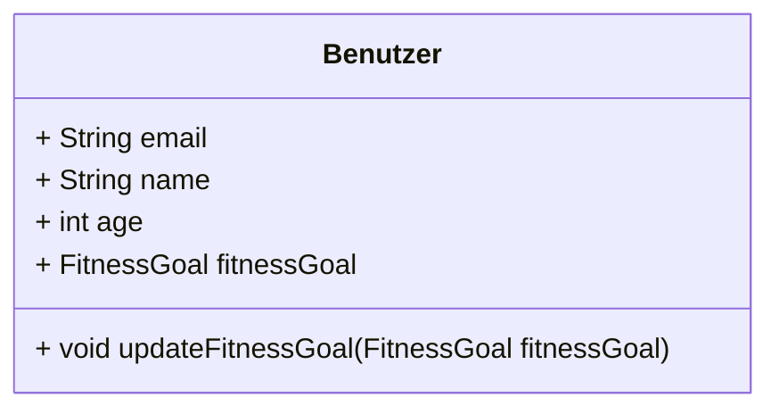

**Beschreibung:** Die Entität "Benutzer" repräsentiert einen Benutzer der Anwendung mit seinen persönlichen Daten und Fitnesszielen.<br>
**Begründung:** Diese Entität ist notwendig, um die Benutzerinformationen und deren Fitnessziele zu verwalten.

### GymPlan
**UML:**

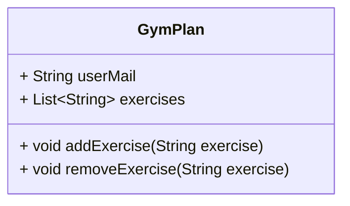

**Beschreibung:** Die Entität "GymPlan" repräsentiert einen Trainingsplan eines Benutzers.<br>
**Begründung:** Diese Entität ist notwendig, um die Struktur und den Inhalt der Trainingspläne zu verwalten.

### Mahlzeit
**UML:**

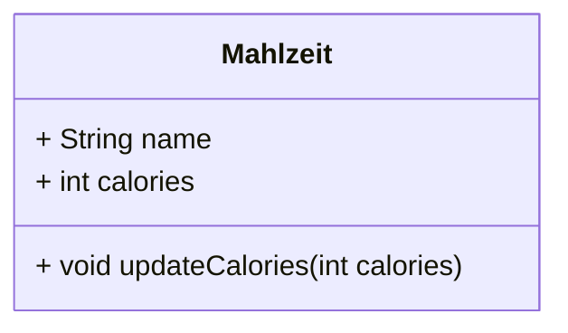

**Beschreibung:** Die Entität "Mahlzeit" repräsentiert eine protokollierte Mahlzeit eines Benutzers.<br>
**Begründung:** Diese Entität ist notwendig, um die Nahrungsaufnahme der Benutzer zu verwalten.

### Gewicht
**UML:**

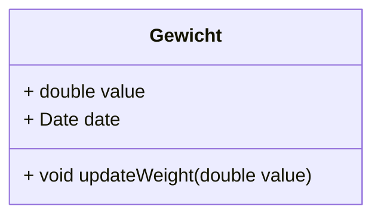

**Beschreibung:** Die Entität "Gewicht" repräsentiert das Körpergewicht eines Benutzers zu einem bestimmten Zeitpunkt.<br>
**Begründung:** Diese Entität ist notwendig, um die Gewichtsveränderungen der Benutzer zu verwalten.

## Value Objects
### FitnessGoal
**UML:**

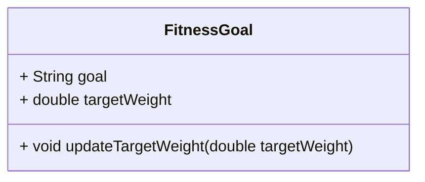

**Beschreibung:** Das Value Object "FitnessGoal" repräsentiert das Fitnessziel eines Benutzers.<br>
**Begründung:** Dieses Value Object ist notwendig, um die Fitnessziele der Benutzer zu verwalten und sicherzustellen, dass sie unveränderlich sind.

## Repositories
### BenutzerRepository
**UML:**

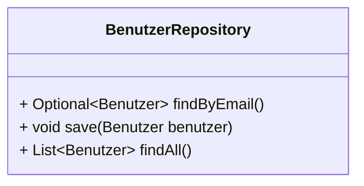
     
**Beschreibung:** Das Repository "BenutzerRepository" verwaltet die Speicherung und den Zugriff auf Benutzerinformationen.<br>
**Begründung:** Dieses Repository ist notwendig, um die Benutzerinformationen persistent zu speichern und darauf zuzugreifen.

## Aggregates
### Warum keine Aggregate?
In unserer aktuellen Implementierung haben wir keine Aggregate definiert. Ein Aggregate ist ein Cluster von zusammengehörigen Objekten, die als eine Einheit behandelt werden. In unserem Fall könnten wir theoretisch ein BenutzerAggregate haben, das Benutzer, GymPlan, Mahlzeit und Gewicht umfasst. 

Allerdings haben wir uns entschieden, diese Entitäten separat zu behandeln und über Repositories zu verwalten. Das vereinfacht die Implementierung und vermeidet Komplexitäten, die mit der Verwaltung von Aggregates einhergehen. Jede Entität hat ihre eigenen Verantwortlichkeiten und wird unabhängig voneinander verwaltet.


# Kapitel 7: Refactoring
## Code Smells

### Long Method
```https://vscode.dev/github/ASE-Foodtracker/x-foodtracker/blob/documentation/1-foodtracker-adapters/src/main/java/de/jmf/adapters/ConsoleAdapter.java#L75```
```Java    
    public void running()
        while
            try
                switch
                    case
                        while
                            else
                                if
```

Diese Methode ist viel zu lang und viel zu sehr in sich selbst verschachtelt. Dafür ist ein Refactoring definitiv von Nöten.<br>
**Lösungsweg:**<br> Die Methode in mehrere kleine Methoden aufteilen.
```Java    
public void running(){
    boolean running = true;
    init();
    while(running){
        printMenu();
        int option = getInt("Please enter the number of the action you want to perform: ");
        running = handleMenu(option)
    }
}
private void handleMenu(int option){
    case 0:
        …
    case 1:
        …
}
```
### Large Class
```1-foodtracker-adapters/src/main/java/de/jmf/adapters/handlers/UserHandler.java```
```Java    
public class UserHandler{
    …
    public UserHandler(){}
    public boolean saveUser(){}
    public User logUser(){}
    public String getUserMail(){}
    public String getUserFitnessGoal(){}
    public boolean login(){}
    public boolean createUser(){}
    public void logOut(){}
    private int getInt(){}
    private String getString(){}
    private Double getDouble(){}
}
```

Diese Klasse hat definitiv zu viele Verantwortlichkeiten.<br>
**Lösungsweg:**<br>Wir können die Methoden zur Benutzereingabe in eine separate Klasse auslagern: 
```Java    
public class UserHandler{
    …
    public UserHandler(){}
    public boolean saveUser(){}
    public User logUser(){}
    public String getUserMail(){}
    public String getUserFitnessGoal(){}
    public boolean login(){}
    public boolean createUser(){}
    public void logOut(){}
}

public class InputHandler{
    public int getInt(){}
    public String getString(){}
    public Double getDouble(){}
}
```
## 2 Refactorings
### Rename Method
#### Commit
https://github.com/ASE-Foodtracker/x-foodtracker/commit/aca842f75f4fc81a0d29ac42a03d60f5a1557aba <br>
**Begründung:**<br> Durch dieses renaming wurde die Lesbarkeit und das Verständnis des Codes erhöht. Wer nichts mit dem Methodennamen anfangen kann, hat es deutlich schwerer sich durch den Code zu lesen und ihn zu verstehen.

### Rename Class
#### Commit
https://github.com/ASE-Foodtracker/x-foodtracker/pull/29/commits/a0d2131eeef7de4166dce89357c0af5f6e8ab26a
#### Begründung
Unser InputReader hieß vorher InputValidator. Da er aber nichts validiert, ist der Name hier irreführend.

### Extract Method
#### Commit
1. https://github.com/ASE-Foodtracker/x-foodtracker/commit/e4579ee59ff6f9922ee2800f3e7888493949e539
2. (Ausgelagert) https://github.com/ASE-Foodtracker/x-foodtracker/commit/fa13e490e1872d75a89f34bbe5ec0ac47706e0e6
#### Begründung
Unser ConsoleAdapter hatte mehrere Funktionen, die sich über den ganzen Bildschirm streckten. Hier haben wir einen Commit, der sich um die "running" Methode kümmert. Die einst große Methode wurde in mehrere Untermethoden ausgelagert, was die Readability deutlich erhöht!

Mein Dezi meinte einst: **"Wenn ich meine Brille abnehme und sehen kann, dass der Code über den halben Bildschirm verschachtelt ist, dann muss dort auf jeden Fall gerefactored werden!"**

### Anmerkung
Es wurden insgesamt mehrere Refactorings angewand, jedoch sind nur zwei angefragt worden. Bei Fragen stehen wir gerne zur Verfügung und erläutern mehreres :)

# Kapitel 8: Entwurfsmuster
## Entwurfsmuster: Dekorator
### Commit
https://github.com/ASE-Foodtracker/x-foodtracker/pull/29/commits/82a5c9065ea1ae1f140b7228cee71a79411759f6
### Einsatz
Das Dekorator-Muster wird verwendet, um einem Objekt zur Laufzeit zusätzliche Verantwortlichkeiten hinzuzufügen, ohne seine Struktur zu ändern. In unserem Projekt können wir das Dekorator-Muster verwenden, um zusätzliche Nährwertinformationen zu den Mahlzeiten hinzuzufügen, wie z.B. den Fett- und Kohlenhydratgehalt.

### Beispiel
Wir haben eine Mahlzeitenklasse, die wir mit zusätzlichen Nährwertinformationen wie Fett und Kohlenhydraten dekorieren möchten.

### Code
```java
public class Meal {
    private final String name;
    private final int protein;
    private final int calories;

    public Meal(String name, int protein, int calories) {
        this.name = name;
        this.protein = protein;
        this.calories = calories;
    }

    public String getName() {
        return name;
    }

    public int getProtein() {
        return protein;
    }

    public int getCalories() {
        return calories;
    }

    public int getFat() {
        return 0;
    }

    public int getCarbs() {
        return 0;
    }
}

// filepath: de/jmf/domain/decorator/MealDecorator.java
package de.jmf.domain.decorator;
import de.jmf.domain.entities.Meal;

public abstract class MealDecorator extends Meal {
    protected Meal decoratedMeal;

    public MealDecorator(Meal decoratedMeal) {
        super(decoratedMeal.getName(), decoratedMeal.getProtein(), decoratedMeal.getCalories());
        this.decoratedMeal = decoratedMeal;
    }

    @Override
    public String getName() {
        return decoratedMeal.getName();
    }

    @Override
    public int getCalories() {
        return decoratedMeal.getCalories();
    }

    @Override
    public int getProtein() {
        return decoratedMeal.getProtein();
    }

    public abstract int getFat();
    public abstract int getCarbs();
}

// filepath: de/jmf/domain/decorator/FatDecorator.java
package de.jmf.domain.decorator;
import de.jmf.domain.entities.Meal;

public class FatDecorator extends MealDecorator {
    private final int fat;

    public FatDecorator(Meal decoratedMeal, int fat) {
        super(decoratedMeal);
        this.fat = fat;
    }

    @Override
    public int getFat() {
        return fat;
    }

    @Override
    public int getCarbs() {
        return decoratedMeal instanceof MealDecorator ? ((MealDecorator) decoratedMeal).getCarbs() : 0;
    }
}

// filepath: de/jmf/domain/decorator/CarbsDecorator.java
package de.jmf.domain.decorator;
import de.jmf.domain.entities.Meal;

public class CarbsDecorator extends MealDecorator {
    private final int carbs;

    public CarbsDecorator(Meal decoratedMeal, int carbs) {
        super(decoratedMeal);
        this.carbs = carbs;
    }

    @Override
    public int getCarbs() {
        return carbs;
    }

    @Override
    public int getFat() {
        return decoratedMeal instanceof MealDecorator ? ((MealDecorator) decoratedMeal).getFat() : 0;
    }
}
```
### Verwendung:
``` Java
Meal meal = new Meal("Chicken Salad", 30, 400);
meal = new FatDecorator(meal, 10);
meal = new CarbsDecorator(meal, 20);
```


```mermaid
classDiagram
    class Meal {
        + getName()
        + getProtein()
        + getCalories()
        + getFat()
        + getCarbs()
    }

    class MealDecorator {
        - decoratedMeal
        + getName()
        + getProtein()
        + getCalories()
        + getFat()
        + getCarbs()
    }

    class FatDecorator {
        + getFat()
        + getCarbs()
    }

    class CarbsDecorator {
        + getCarbs()
        + getFat()
    }

    Meal <-- MealDecorator
    MealDecorator <-- FatDecorator
    MealDecorator <-- CarbsDecorator
```

**Begründung:**<br>
Das Dekorator-Muster ermöglicht es uns, zusätzliche Nährwertinformationen wie Fett und Kohlenhydrate hinzuzufügen, ohne die grundlegende Mahlzeitenklasse zu ändern. Dies erhöht die Flexibilität und Erweiterbarkeit des Codes.

## Entwurfsmuster: Erbauer
### Commit
https://github.com/ASE-Foodtracker/x-foodtracker/pull/29/commits/5d20b61e0c902d0c06af8d984434dbb34966885b
### Einsatz
Das Erbauer-Muster wird verwendet, um die Konstruktion eines komplexen Objekts zu trennen, sodass derselbe Konstruktionsprozess verschiedene Darstellungen erzeugen kann. In unserem Projekt können wir das Erbauer-Muster verwenden, um komplexe Benutzerobjekte mit verschiedenen Attributen zu erstellen.

### Beispiel
Wir haben eine Benutzerklasse, die viele Attribute hat. Mit dem Erbauer-Muster können wir Benutzerobjekte schrittweise und kontrolliert erstellen. Vor allem wenn wir vom Index, der gerade die E-Mail ist, auf eine ID wechseln, dann kann die E-Mail auch optional sein.


### Code
```Java
public class User {
    private String name;
    private int age;
    private String email;
    private List<WorkoutPlan> workoutPlans;
    private FitnessGoal goal;


    private User(Builder builder) {
        this.name = builder.name;
        this.age = builder.age;
        this.email = builder.email;
        this.goal = builder.goal;
        this.workoutPlans = builder.workoutPlans;
    }

    public static class Builder {
        private String name;
        private int age;
        private String email;
        private List<WorkoutPlan> workoutPlans = new ArrayList<>();
        private FitnessGoal goal;

        public Builder setName(String name) {
            this.name = name;
            return this;
        }

        public Builder setAge(int age) {
            this.age = age;
            return this;
        }

        public Builder setEmail(String email) {
            this.email = email;
            return this;
        }

        public Builder setGoal(FitnessGoal goal) {
            this.goal = goal;
            return this;
        }

        public Builder setWorkoutPlans(List<WorkoutPlan> workoutPlans) {
            this.workoutPlans = workoutPlans;
            return this;
        }

        public User build() {
            return new User(this);
        }
    }
}
```


```mermaid
classDiagram
    class User {
        - email
        - name
        - age
        - goal
    }

    class UserBuilder {
        - email
        - name
        - age
        - goal
        + setEmail()
        + setName()
        + setAge()
        + setGoal()
        + build()
    }

    User <-- UserBuilder
```
**Begründung:**<br>
Das Erbauer-Muster ermöglicht es uns, komplexe Benutzerobjekte schrittweise und kontrolliert zu erstellen. Dies erhöht die Lesbarkeit und Wartbarkeit des Codes, da die Konstruktion von Benutzerobjekten klar und strukturiert ist.
